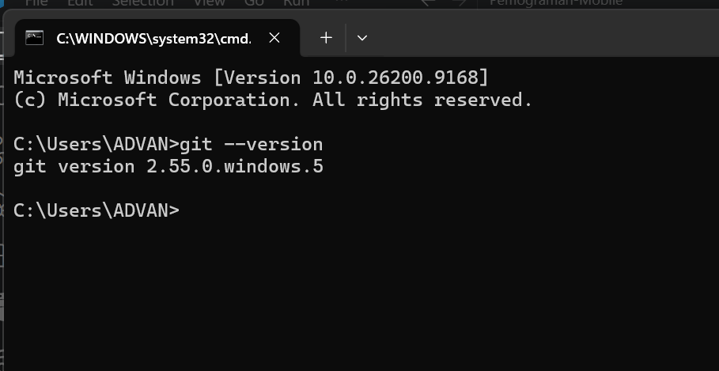
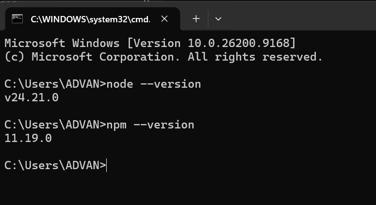
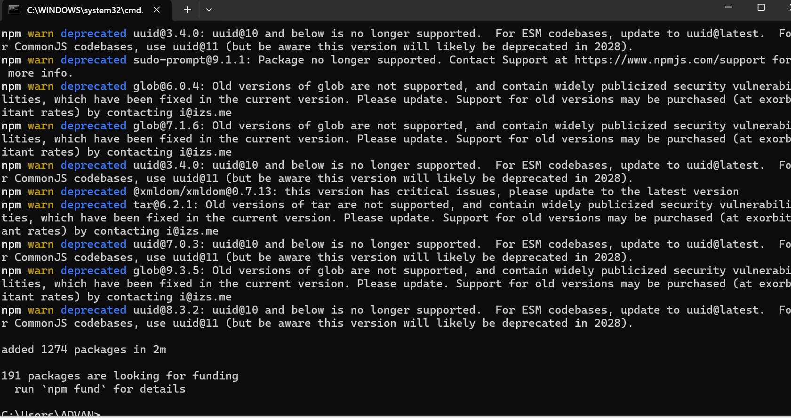
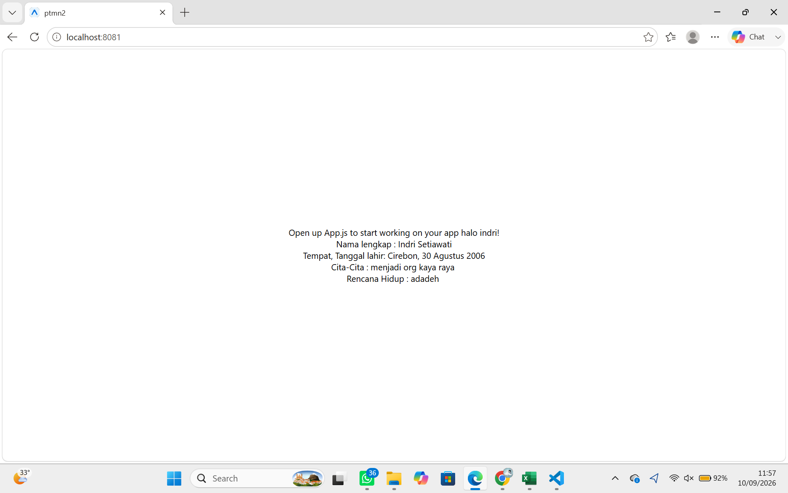

# ** Praktikum menyiapkan memulai pemograman mobile dengan react native 

## ** Tujuan Pembelajaran **
setelah menyelesaikan modul praktikum ini, mahasiswa di harapkan mampu:
- menginstall git dan github
- menginstall node.js dan NPM
- menginstall expo CLI
- membuat project react native
- menjalankan project react native

1. Install git di local
    - unduh dan install git via https://git-scm.com/install/windows
    - verifikasi git (buka cmd dan ketik "git --version")
    
2. Install Node JS
    - Unduh dan install Node js via https://nodejs.org/en/download
    - verifikasi node js (buka cmd dan ketik "node --version")
    

3. Install expo CLI
    - install expo cli via cmd (ketik "npm install -g expo-cli" )
    

4. memulai projek dengn framework expo
    - buka terminal pakai code editor 
    - pastikan aktif di directory yang dituju
    - ketikan (npx create-expo-app ptmn2 --template blank)
    - ketikan (npx expo start)
    
5. web
    

