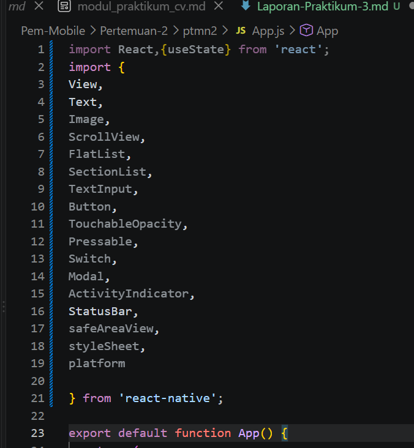
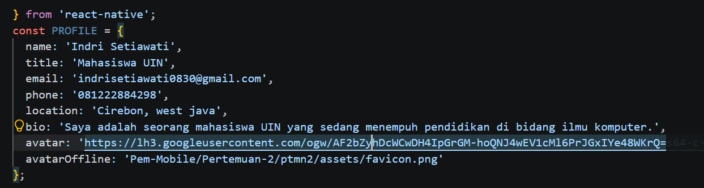
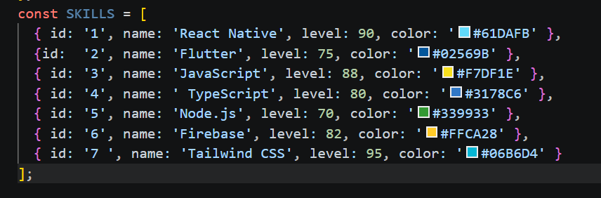
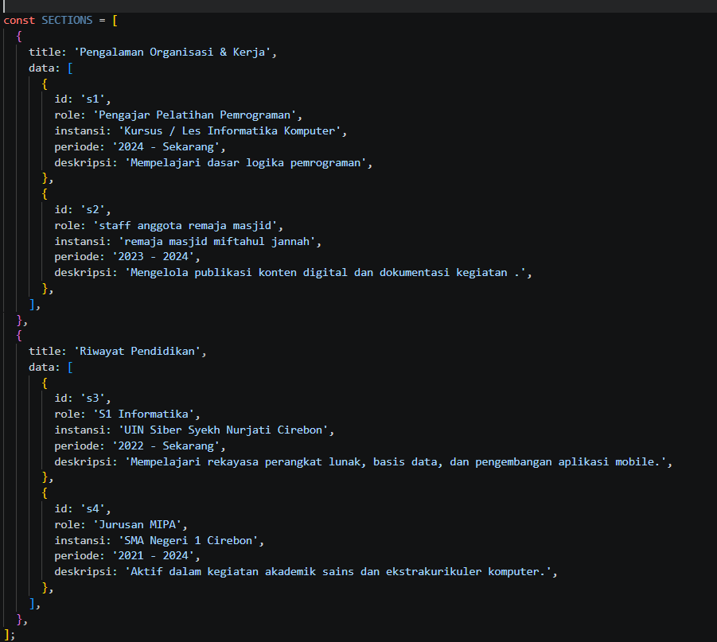
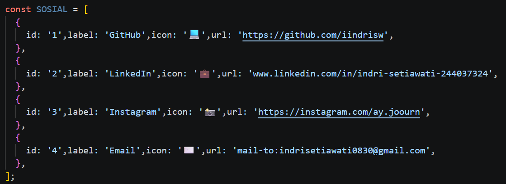
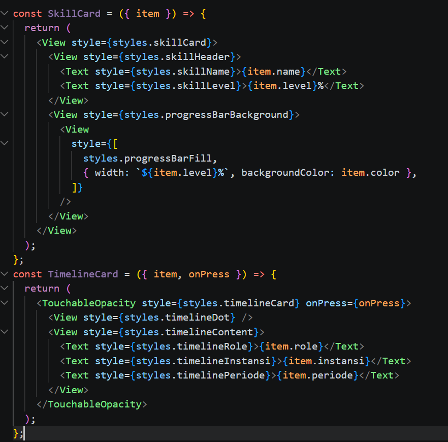
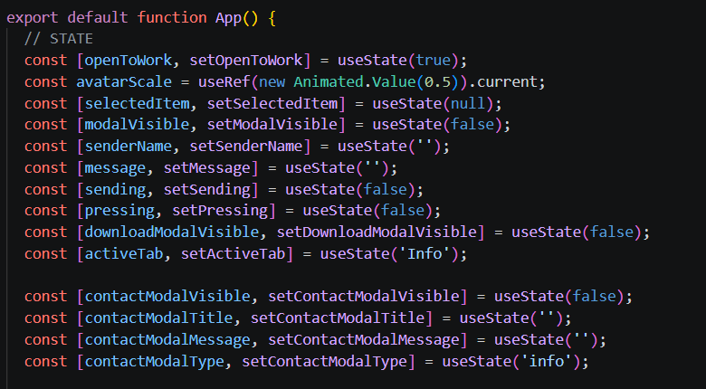
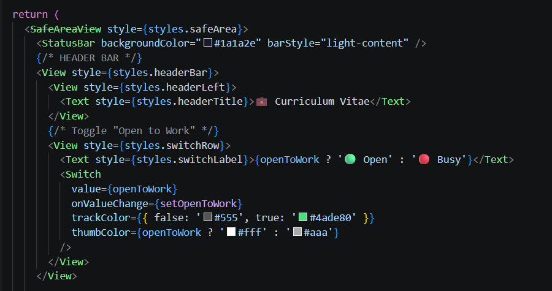

# Laporan Praktikum Pemograman Mobile 3 #
### Pengenalan core Component dan styling ###

## 🎯 Tujuan Pembelajaran
Setelah menyelesaikan praktikum ini, mahasiswa mampu:

Memahami dan menggunakan 16 Core Components React Native
Menerapkan **StyleSheet** untuk styling terpusat
Menggunakan **useState** untuk state management dasar
Membuat layout yang responsif dengan **Flexbox**
Menangani **interaksi pengguna**  (tekan, input, scroll)

Langkah 1 : Menginpor Components
1. Buka file App.js pada folder projek ptmn2
2. inport 16 core components sebagai berikut 
3. konfirmasi bukti

Langkah 2 : Menyiapkan data (objek dan array)
1. membuat objek untuk menyimpan data profile
2. membuat objek array bernama PROFILE
3. Konfirmasi bukti

4. Membuat objek array SKILLS untuk menyimoan data skills
5. buat objek bernama SKILLS
6. konfirmasi bukti

7. membuat objek array SECTION untuk menampung riwayat pekerjaan
Konfirmasi bukti

8. membuat onjek array SOCIAL untuk menampung data sosial media
konfirmasi bukti

Langkah 3 : Sub-Components (SkillCard & TimelineCard)
konfirmasi bukti

langkah 4 : State Management dengan useState
Konfirmasi bukti 

✅ Checkpoint: Aplikasi masih menampilkan teks, tidak ada error.

Langkah 5 : SafeAreaView, StatusBar & Header
Konfirmasi bukti

Langkah 6 : ScrollView & Profil Section (View, Text, img/image)
Konfirmasi Bukti

Langkah 7 : FlatList (Daftar Skills)
Konfirmasi bukti

Langkah 8 : SectionList (Pengalaman & Pendidikan)
Konfirmasi bukti 

Langkah 9 : TextInput, Button & ActivityIndicator
Konfirmasi bukti

Langkah 10 : Modal (Popup Detail)
Konfirmasi bukti

Langkah 11 : StyleSheet (Styling Terpusat)
Konfirmasi bukti

Langkah 12 : Verifikasi & Pengujian
Konfirmasi bukti