## PRAKTIKUM 4: Navigasi di React Native

## Tujuan Pembelajaran

Setelah menyelesaikan praktikum ini, mahasiswa diharapkan mampu:

1. Memahami konsep dan mekanisme perpindahan layar (_routing_) pada aplikasi _mobile_.
2. Melakukan instalasi dan konfigurasi pustaka `React Navigation`.
3. Mengimplementasikan **Stack Navigation** untuk alur layar linier.
4. Mengimplementasikan **Tab Navigation** untuk menu pintasan bawah.
5. Mengimplementasikan **Drawer Navigation** untuk menu panel samping.

6. # 1. Install core navigation library
npm install @react-navigation/native
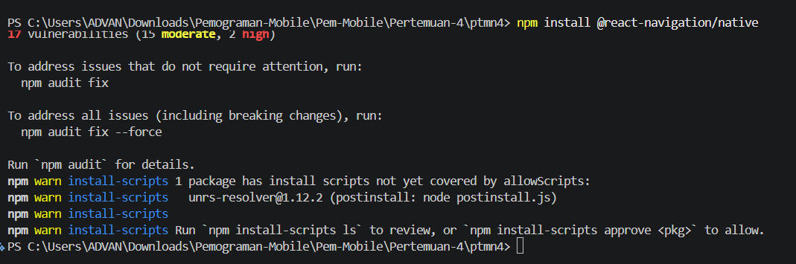

7. # 2. Install dependensi pendukung (wajib untuk Expo)
npx expo install react-native-screens react-native-safe-area-context react-native-gesture-handler react-native-reanimated
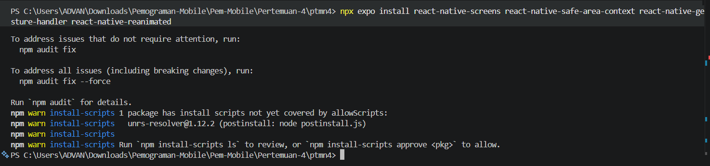

## PRAKTIKUM 1: Stack Navigation

Langkah 1 : Instalasi Pustaka Stack
Jalankan perintah berikut di terminal:
npm install @react-navigation/native-stack
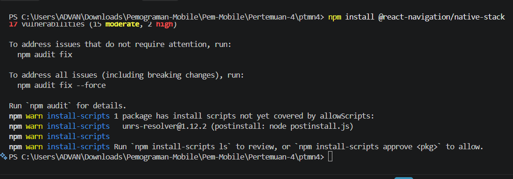

Langkah 2 :
file Login.js
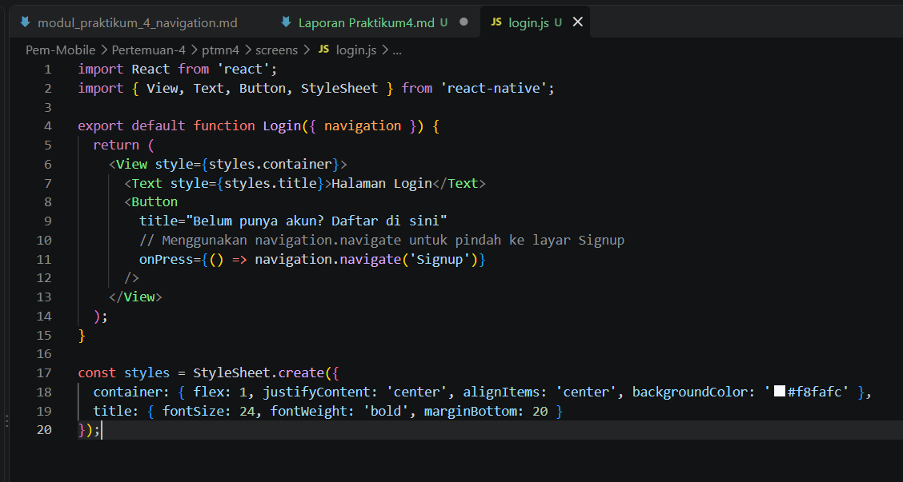
file Signup.js
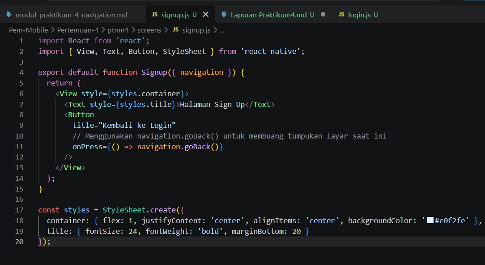

Langkah 3 : Uji coba klik tombol untuk berpindah maju dan mundur antar layar
.gif>)

Langkah 4: konfigurasi app.js
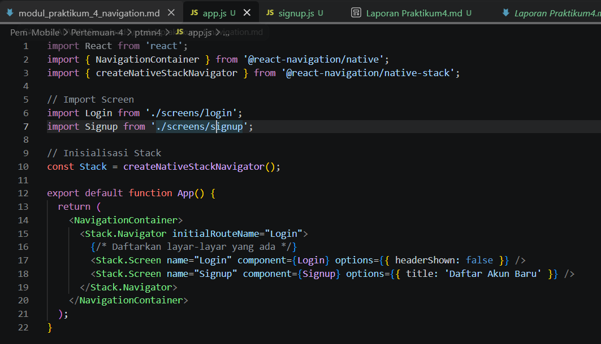

## PRAKTIKUM 2 : Bottom Tab Navigation

Langkah 1 : Instalasi Pustaka Bottom Tabs
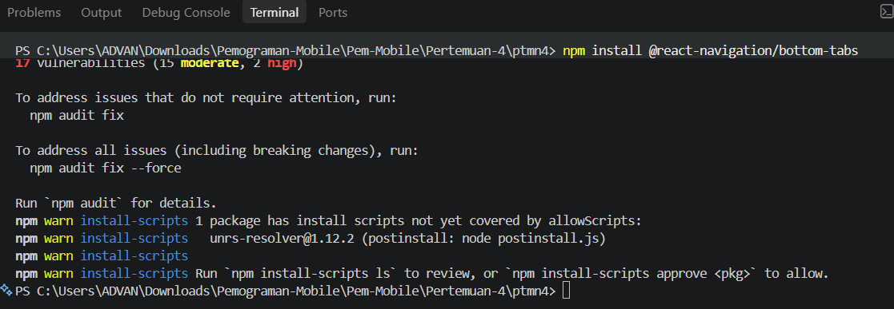

Langkah 2 : Membuat Layar Baru
file HomeScreen.js
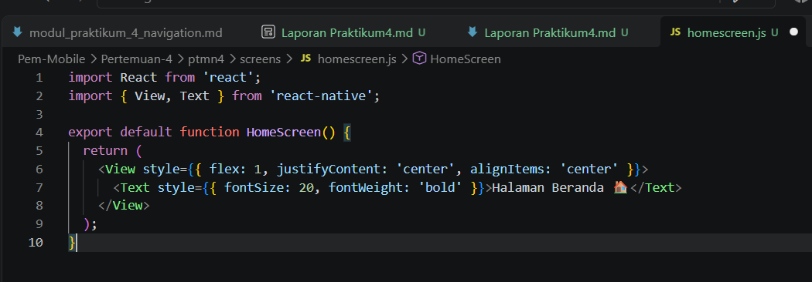
file ProfileScreen.js
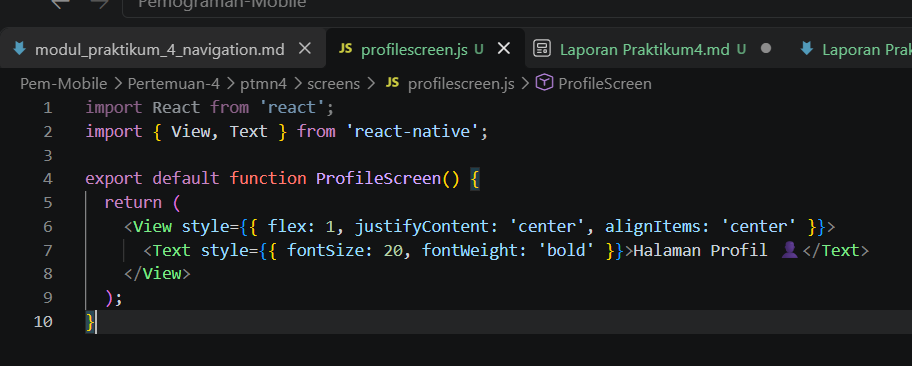

Langkah 3 : Konfigurasi Tab di App.js
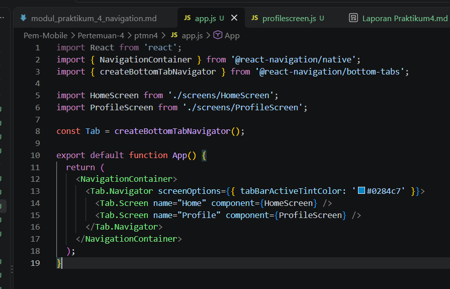

Langkah 4: tab navigation
.gif>)

### Praktikum 3
### Langkah 1: Instalasi Pustaka Drawer
npm install @react-navigation/drawer
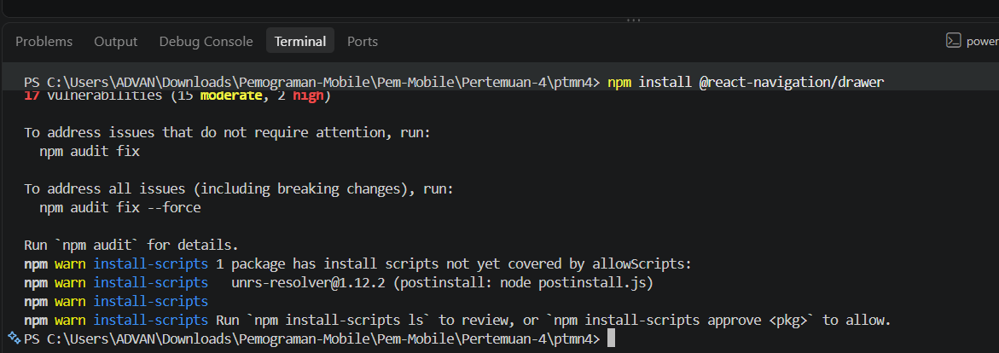

Langkah 2 :Konfigurasi drawer di App.js

